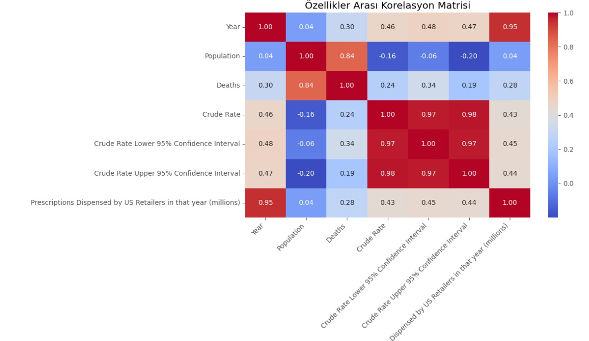
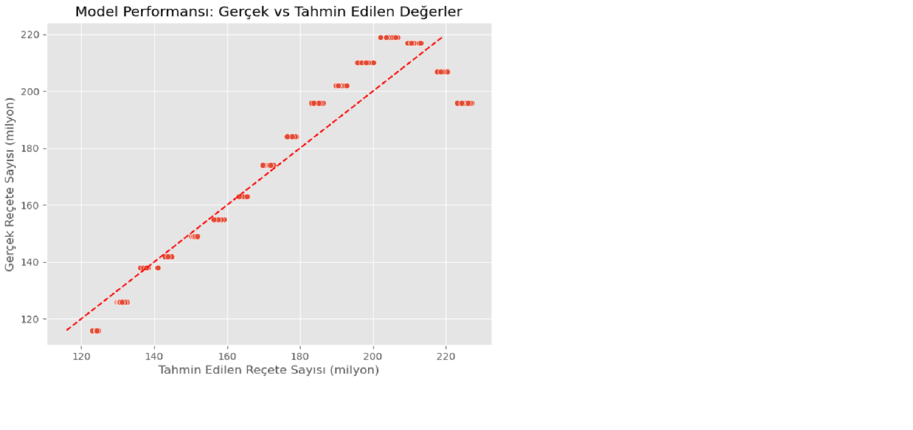

# ABD Opioid Reçete ve Ölüm Oranları Üzerine Regresyon Analizi

Bu projede ABD’deki ilaç reçeteleri ve ölümlerine ait istatistiksel veriler kullanılmıştır. Veri seti eyaletlere ve yıllara göre düzenlenmiştir. 1999–2014 yılları arası baz alınmıştır.

---

## 1. Kullanılan Veri Seti

Projede kullanılan veri seti (datam.csv) aşağıdaki değişkenleri içermektedir:

- Year: Yıl bilgisi  
- State: Eyalet  
- Prescriptions Dispensed by US Retailers in that year (millions): O yıl dağıtılan reçete sayısı  
- Deaths: İlgili yıldaki ölüm sayısı  
- Crude Rate: 100.000 kişi başına düşen ölüm oranı  

---

## 2. Veri Temizleme Süreci

### Eksik Değer Kontrolü
- Veri seti yüklendikten sonra eksik değer analizi yapılmıştır.  
- NaN veya boş değer içeren satırlar temizlenmiştir.

### Veri Tiplerinin Düzenlenmesi
- Sayısal değişkenlerin veri tipleri kontrol edilmiştir.  
- Yanlış formatlı değerler uygun tiplere dönüştürülmüştür.

### Hatalı / Tutarsız Değerlerin Düzeltilmesi
- Negatif veya mantık dışı değerler analiz edilmiştir.  
- Veri bütünlüğünü bozan satırlar çıkarılmıştır.

### Analize Hazırlama
- Modelde bağımsız değişken (X) Crude Rate olarak seçilmiştir.  
- Modelde bağımlı değişken (y) Prescriptions Dispensed olarak belirlenmiştir.

---

## 3. Projenin Amacı ve Tahmin Edilen Değer

Bu çalışmada:

- Yıllara göre reçete sayılarının değişimi incelenmiştir.  
- Eyaletlerdeki ölüm oranları analiz edilmiştir.  
- Crude Rate ile reçete sayısı arasındaki ilişki değerlendirilmiştir.  
- Lineer Regresyon modeliyle reçete tahmini yapılmıştır.  

**Tahmin edilen değer (y):** Prescriptions  
**Bağımsız değişken (X):** Crude Rate  

---

## 4. Kullanılan Makine Öğrenmesi Modeli

Projede Linear Regression modeli kullanılmıştır.
Linear Regression seçme nedenleri:

- Basit ve yorumlanabilir olması
- Doğrusal ilişkiler için uygun olması çünkü korelasyon analizinde girdi değişkenlerinin iki tahmini değişken arasında doğrusal bir ilişki olduğu çıktı
- Hızlı çalışması; her ne kadar büyük veri kullanmamış olsak da kodlanması ve tespit edilmesi hızlıdır
Bu model ilk seçilecek değerler arasında ilk göründüğünde doğrusal bir ilişki olduğu için aslında ilk bu modeli denedim.

Model adımları:

1. Adım = X ve y değişkenlerinin seçilmesi  
2. Adım = Eğitim-test ayrımı yapılması  
3. Adım = Modelin eğitilmesi  
4. Adım = Tahminlerin üretilmesi  
5. Adım = Gerçek ve tahmini değerlerin karşılaştırılması  

---

## 5. Veri Analizi ve Görselleştirmeler

Bu bölümde Jupyter Notebook’taki beş grafik yer almaktadır.  

---

### 5.1 Yıllara Göre Reçete Sayısı Trend Grafiği
- Bu grafikte öncelikle inceleme yapan kişiye yıllara göre reçete sayısını milyon cinsinden göstermek istedik.

---

### 5.2 Eyaletlere Göre Ortalama Ölüm Sayısı
- yıllara göre reçete sayısını anladıktan sonra bir başka sütun olan eyaletlere göe ölüm sayılarını verip fikir oluşturmak istedik.

---

### 5.3 Korelasyon Matrisi
- İlk başta bu grafiği kullanma amacım, veri setindeki sayısal değişkenler arasında bir doğrusalılık var mı? Varsa bunun gücünü ve yönünü göstermektir.
Bu tabloda güçlü olan korelasyonlar bej tonu, daha az güçlü olanlar açık renk ile gösterilmiştir.

- Aralarında tam ve detaylı korelasyon ve bağlantı görülüp raporlanabilir.
- Prescriptions ile Deaths arasındaki ilişki en güçlü ilişkidir (r ≈ 0.84). (Beklenen bir durum)
- Korelasyon katsayısı (-1) ile (+1) arasında değer alır ve değer +1’e ne kadar yakınsa o kadar güçlüdür.
- Grafikteki tonlara bakıldığında Crude Rate ve Prescriptions arasında doğrusal bir ilişki vardır.

Fakat asıl güçlü değişken grafikte github reposunda mevcuttur.
---

### 5.4 Gerçek ve Tahmin Değer Karşılaştırma Grafiği
- Ypatığımız tahminler ve gerçek değerleri tek çizgi halinde kullanıp lineer bir tablo üzerinde göstermek istedik.

---

### 5.5 Crude Rate ve Prescriptions Arasındaki Regresyon Grafiği
- En basit ve vurgulanması bu doğru çizimiyle mümkündür.
- Çizimde modelin gerçek verilerle ortalama olarak doğru ilişkide olduğunu ve tahmin edebilir olduğunu gösterir.
- Tahminin çizgideki mesafesine göre modelin tahmin doğruluğu

- Örnek: 151.19 ama asıl değer 149.00 → 2.19’luk bir sapma var.
- Modelin R² skoru = 0.91
- Ortak bir kare hatası (MSE): 98.33 civarıdır.

**Bu kısımların sonuçları hemen altta metriklerin ne olduğu ve ne işe yaradığı bilgilerini verdik.**
---

## 6. Model Performans Metrikleri

Notebook içerisinde hesaplanan değerlendirme metrikleri:

- **R² Skoru:** Modelin açıklayıcılık oranını gösterir.  
- **RMSE (Root Mean Squared Error):** Tahminlerin ortalama hata büyüklüğünü gösterir.  

---

